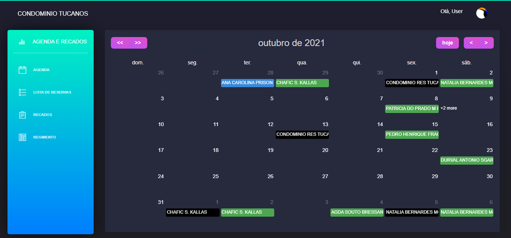
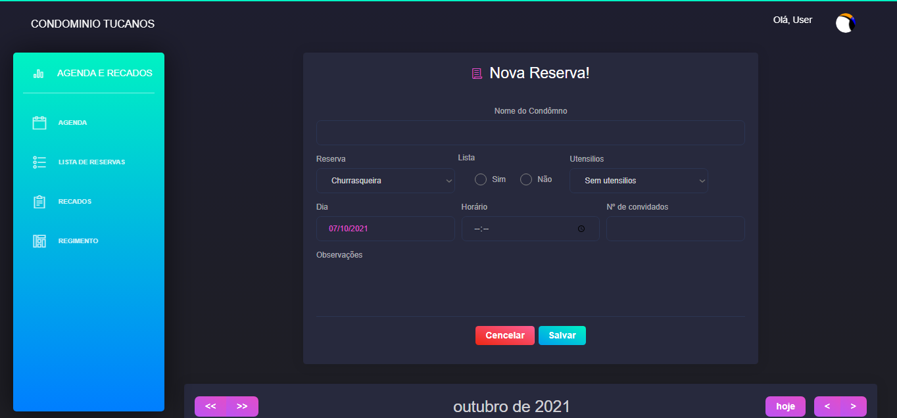
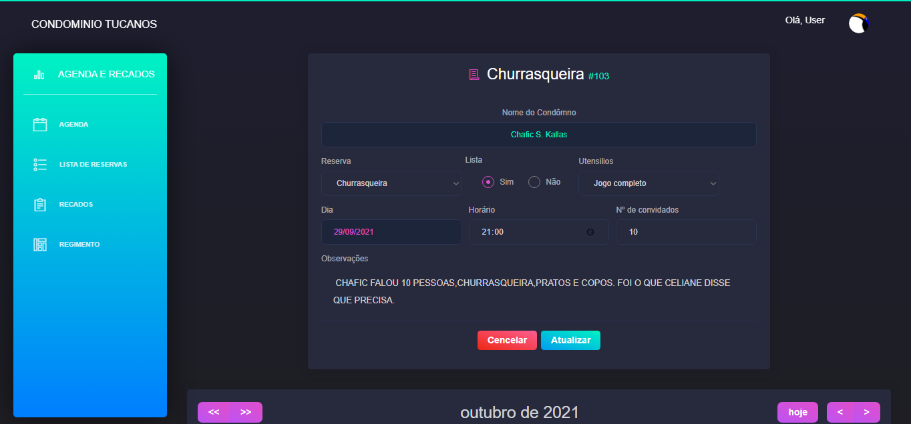
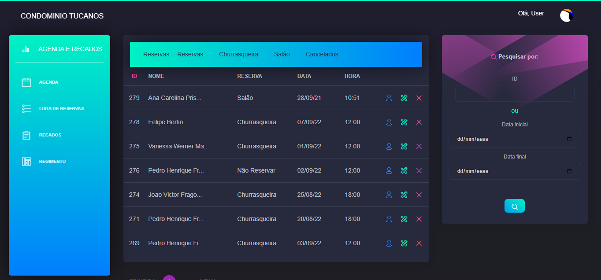
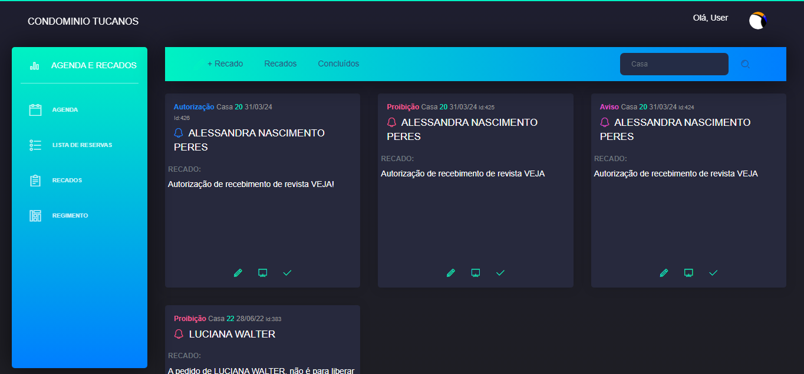
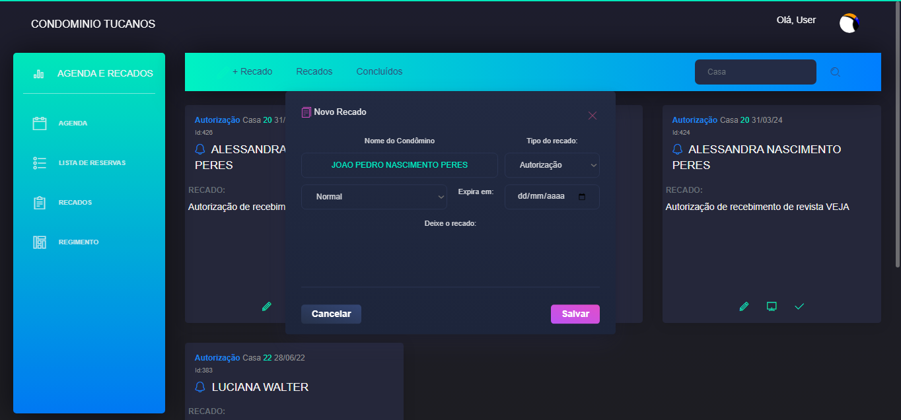

# Agenda Condominal 🏢📅

### Tecnologias Utilizadas
- **Linguagens:** 
   
   
   
  
- **Biblioteca:** Fullcalendar
- **Framework:** Bootstrap para o design responsivo
- **Banco de Dados:** MySQL

### Template Utilizado
### Template Utilizado
[](https://www.creative-tim.com/product/material-dashboard-dark)

-----

### Sobre 💡
A **Agenda Condominal** foi criada especialmente para atender às necessidades do condomínio onde trabalhava como porteiro. Anteriormente, os recados e reservas dos espaços de lazer eram feitos em post-it e deixados no balcão.

Durante meu curso de Análise e Desenvolvimento de Sistemas, fui apresentado à linguagem **PHP**. Foi através dela que desenvolvi esse sistema como parte dos meus estudos. Reconheço que, embora não tenha aplicado as melhores práticas de programação na época, o sistema é funcional e visualmente atraente.

A **Agenda Condominal** possibilita:
  - Cadastro dos usuários (que vão administrar as reservas e recados);
  - Recuperação de senha;
  - Cadastro, edição e exclusão dos condôminos;
  - Cadastro, edição e exclusão das reservas dos espaços;
  - Cadastro, edição e exclusão dos recados.
  
## Usuários 👩‍💼👨‍💼
O usuário pode adicionar condôminos, definindo se são moradores ou ex-moradores. Após o cadastro, ao reservar ou deixar algum recado, o nome do condômino será automaticamente preenchido. Por padrão, são 3 espaços de lazer para reservar. Ao agendar, a **reserva** possibilita:
- Reservar diretamente em nome do condômino;
- Definir qual espaço será utilizado;
- Definir hora, data e itens a serem utilizados;
- Incluir observações.

Por padrão, existem 3 tipos de **recados**: Autorização, Aviso e Proibição, que possibilitam:
- Cadastrar recados diretamente em nome do condômino;
- Definir prioridade (normal, alta e urgente);
- Definir data de expiração do recado;
- Incluir o conteúdo do recado.

Em todas as operações, são registradas a data, a hora e o usuário que efetuou a ação. Nas reservas, é possível pesquisar por ID e período de data. Nos recados, é possível pesquisar por número do imóvel, recados ativos e concluídos.

O usuário também pode, na pagina "regimento.php", pesquisar nome do morador para saber sua respectiva casa. Isso ajuda, de forma significativa, os novos porteiros que não sabe nome, casa e localização, visto também que nessa pagina, há um mapa de facil entendimento.
-----

### Capturas de Tela 📸







-----

## Guia para Instalação do Projeto no XAMPP

### Passo 1: Clone do Repositório
- Abra o terminal ou prompt de comando.
- Navegue até a pasta `htdocs` do seu XAMPP (normalmente localizada em `C:\xampp\htdocs`).
- Execute o seguinte comando para clonar o repositório:

```bash
git clone https://github.com/BrunohTrindade/Agenda-condominal
``` 

### Passo 2: Configuração do Banco de Dados
- Na pasta raiz do projeto, há o arquivo de backup: database_backup.sql (contém a estrutura e dados para teste).
- Abra o phpMyAdmin no seu navegador ou SGBD MySQL.
- Crie um novo banco de dados com o nome desejado para o seu projeto.
- Importe o arquivo de backup para o banco de dados recém-criado.

### Passo 3: Alterar credenciais do Banco de Dados
- Na raiz do projeto, acesse: config/db.php e altere conforme o seu banco de dados
``` bash
	$db_name = 'db_name';
	$db_host = 'db_host';
	$db_user = 'db_user';
	$db_pass = 'password';
```

### Passo 4: Acesso ao Projeto
- Abra o seu navegador.
- Digite http://localhost/AgendaCondominal na barra de endereços.
- O seu projeto deve estar agora acessível e pronto para uso.

-----

### Considerações Finais 🌟
Como mencionado anteriormente, o sistema foi criado com base na necessidade específica de um condomínio e pode ser facilmente adaptado para outras necessidades! 😊
